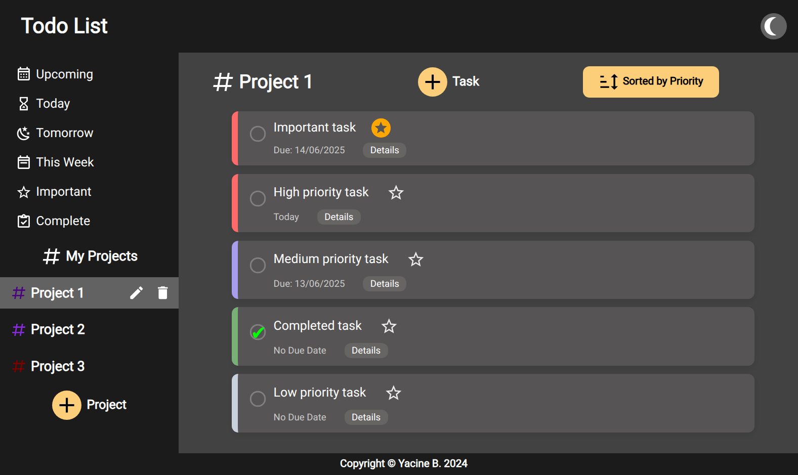

# Todo List

Simple app for organizing & keeping track of your Todos for different projects.



# [Live Preview](https://github.com/3antozz/Todo-List)

## Why build this project ?

This was a project assignment from The Odin Project's Javascript course. The intention of this was to practice organizing javascript code with modules, classes, OOP principles...

## Features

- Core features: Create, edit, group & delete tasks.
- Sort tasks by date & priority.
- Data persistence locally using LocaStorage.
- Responsive design & dark theme.

## Technologies Used

- HTML
- Javascript
- CSS
- Webpack
- Jest

## 🛠️ How to Run the Project Locally

### Prerequisites

- [Node.js](https://nodejs.org/)
- [npm](https://www.npmjs.com/)

---

### 1. Clone the Repository

```bash
git https://github.com/3antozz/Battleship
cd Battleship
```

2- Start the server:

```bash
npm install
npm run dev
```
> [!NOTE]
> The server will run on http://localhost:8080 by default.

### 3. Open in Browser

1- Once the server is running:

2- Visit http://localhost:3000 in your browser

